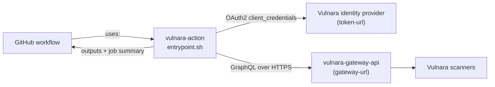

# Vulnara Scan Action

<table>
  <tr><th>CI</th><th>Code</th><th>OpenSpec</th><th>Security</th></tr>
  <tr>
    <td>
      <a href="../../actions/workflows/tests.yml"></a><br>
      <a href="../../actions/workflows/openspec.yml"></a><br>
      <a href="../../actions/workflows/openspec-badges.yml"></a>
    </td>
    <td>
      <a href="../../tags"></a><br>
      <br>
      <br>
      <a href="../../commits/main"></a>
    </td>
    <td>
      <a href="openspec/specs/"></a><br>
      <a href="openspec/specs/"></a><br>
      <a href="openspec/specs/"></a><br>
      <a href="openspec/"></a>
    </td>
    <td>
      <a href="LICENSE"></a><br>
      <a href="SECURITY.md"></a><br>
      <a href="../../security/advisories"></a>
    </td>
  </tr>
</table>

Run a [Vulnara](https://vulnara.rso.dev) security scan on a branch from CI and gate the build
on what it finds. The action is a Docker container action built from a single Bash script: it
exchanges a Vulnara service account for a short-lived JWT, resolves the repository and the
requested scanners through the Vulnara GraphQL gateway, starts one scan per scanner on the
branch, blocks until they finish, writes a job summary linking every finding to the offending
line of code, and fails the job when the highest finding severity reaches the `fail-on`
threshold. Nothing is downloaded at run time: the image is Alpine plus `bash`, `curl` and `jq`.

## How it works

Five numbered steps, each printed to the log with a `vulnara:` prefix.

1. **Authenticate.** An OAuth 2.0 `client_credentials` exchange trades `service-account` plus
   `token` for a JWT, refreshed automatically 120 seconds before it expires so a long scan does
   not fail.
2. **Resolve the repository.** Looked up by name in Vulnara and matched on the owner half of
   `repository`. Warns if the repository is disabled, or private with no `git-token-id`.
3. **Resolve the scanners.** Each entry in `scan-tools` is matched against a tool id or name.
4. **Start and await the scans.** One scan per scanner, all started up front, then polled every
   `poll-interval` seconds until each reaches a terminal state.
5. **Evaluate the findings.** Counted per severity, rendered into the job summary, written to
   the outputs, and gated: the job fails when the highest severity reaches `fail-on`.

Every request carries `Authorization: Bearer <jwt>` and `X-Tenant: <tenant>`, and every body is
built with `jq -n`, so no input is interpolated into a query unencoded.

## Architecture

The action is a client, not a service. It holds no state and runs no scanner itself: the
platform clones the repository and runs the scan containers. It talks to exactly two hosts, the
identity provider for the token exchange and the Vulnara gateway for everything else, and both
are overridable so the action can be pointed at a non-production Vulnara. The web app is never
called; `app-url` only builds links in the job summary.



Sequence diagram and internals: [docs/architecture.md](docs/architecture.md).

## Quick start

1. Add the repository to Vulnara and enable it.
2. Create a service account (Access & Security -> Service Accounts) in the tenant that owns the
   repository, and store its token as a GitHub Actions secret (`VULNARA_TOKEN`).
3. Copy [`examples/vulnara-scan.yml`](examples/vulnara-scan.yml) into `.github/workflows/`.
4. Set `tenant`, `scan-tools` and `fail-on`, and commit.

```yaml
name: Vulnara Scan
on:
  push:
    branches: [main]
  pull_request:

jobs:
  scan:
    runs-on: ubuntu-latest
    steps:
      - uses: theorigamicorporation/vulnara-action@v1
        with:
          service-account: ${{ vars.VULNARA_SERVICE_ACCOUNT }}
          token: ${{ secrets.VULNARA_TOKEN }}
          tenant: my-tenant
          scan-tools: AEGIS         # name or id; comma-separate for several
          fail-on: high             # fail the build on High or Critical findings
          # branch defaults to the branch that triggered the workflow
          # git-token-id: <id>      # required for private repositories
```

The repository must already exist in Vulnara under the same owner name as on GitHub and be
**enabled**, private repositories additionally need a `git-token-id`, and the action runs on
Linux runners only because GitHub runs container actions only there. The job blocks for the
whole scan, so read
[how `wait-timeout` compounds](docs/troubleshooting.md#a-multi-scanner-run-takes-far-longer-than-wait-timeout)
before adding a second scanner.

## Inputs

| Input | Required | Default | Description |
|---|---|---|---|
| `service-account` | yes | | Service account username. |
| `token` | yes | | Service account token. Pass it from a secret. |
| `tenant` | yes | | Vulnara tenant (workspace) id. |
| `scan-tools` | yes | | Comma-separated scanner names or ids. |
| `branch` | no | triggering branch | Branch to scan. |
| `repository` | no | current repo | `owner/name` to resolve in Vulnara. |
| `git-token-id` | no | | Vulnara git token id (private repositories). |
| `fail-on` | no | `critical` | Fail at or above: `none` \| `low` \| `medium` \| `high` \| `critical`. |
| `create-issue` | no | `false` | Open an issue for findings. |
| `auto-remediate` | no | `false` | Open a fix pull request (requires `create-issue`). |
| `wait-timeout` | no | `1800` | Max seconds to wait, **per scan**. |
| `poll-interval` | no | `15` | Seconds between status checks. |
| `app-url` | no | prod | Web app base URL, used for links in the job summary. |
| `gateway-url` | no | prod | GraphQL gateway URL. |
| `token-url` | no | prod | OAuth token endpoint. |
| `oauth-client-id` | no | prod | OAuth client id for the token exchange. |

Outputs (`scan-result-ids`, `highest-severity`, `passed`), validation rules and the runner
environment the action reads: [docs/configuration.md](docs/configuration.md).

> **Working on this action?** It is driven by [just](https://just.systems/). Run `just` for the
> recipe list, `just test` for the offline suite, and `just ci` for lint, tests and the image
> build together.

## Documentation

| Guide | What is in it |
|---|---|
| [Architecture](docs/architecture.md) | Diagrams, components, the five-step flow, the request shape |
| [Configuration](docs/configuration.md) | Every input, output, validation rule and environment variable |
| [Reference](docs/reference.md) | The severity gate, the scanner codenames, the job summary contract |
| [Troubleshooting](docs/troubleshooting.md) | Three known issues, then the common failures |
| [Development](docs/development.md) | Local checks, non-prod runs, conventions, releasing |
| [Testing](docs/testing.md) | What is verified today and what the specs require |
| [Specifications](openspec/specs/) | The normative behaviour: 3 capabilities, 15 requirements, 43 scenarios |

Read [Troubleshooting](docs/troubleshooting.md) before trusting a green build: a tool-resolution
failure currently annotates an error and then exits `0`, so the gate passes without a scan
having run.

## Related repositories

Part of the [Vulnara](https://github.com/theorigamicorporation/vulnara-dev) platform.
Start there for the local stack and the architecture overview.

| Repo | Relationship |
|---|---|
| [vulnara-gateway-api](https://github.com/theorigamicorporation/vulnara-gateway-api) | The only API this action calls. Owns authentication, tenancy and every query and mutation used here |
| [vulnara-cli](https://github.com/theorigamicorporation/vulnara-cli) | The terminal equivalent of this action against the same gateway |
| [vulnara-dev](https://github.com/theorigamicorporation/vulnara-dev) | Local stack, for running a non-production gateway to develop against |

## Contributing

Bug reports and pull requests are welcome. See [CONTRIBUTING.md](CONTRIBUTING.md) for branch
naming, commit format and the OpenSpec workflow, and [SECURITY.md](SECURITY.md) for the private
disclosure route, which is where suspected vulnerabilities go instead of the issue tracker.

This repository is public. Keep examples, fixtures and documentation free of real tenant ids,
hostnames and credentials.

## License

[MIT](LICENSE). Copyright (c) 2026 The Origami Corporation.
