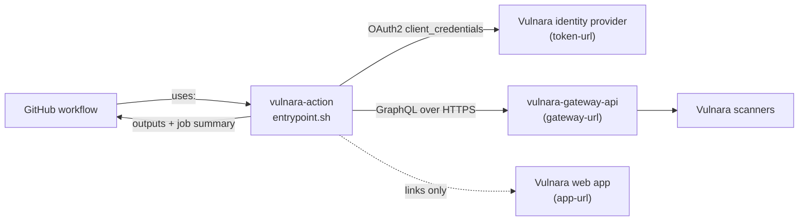
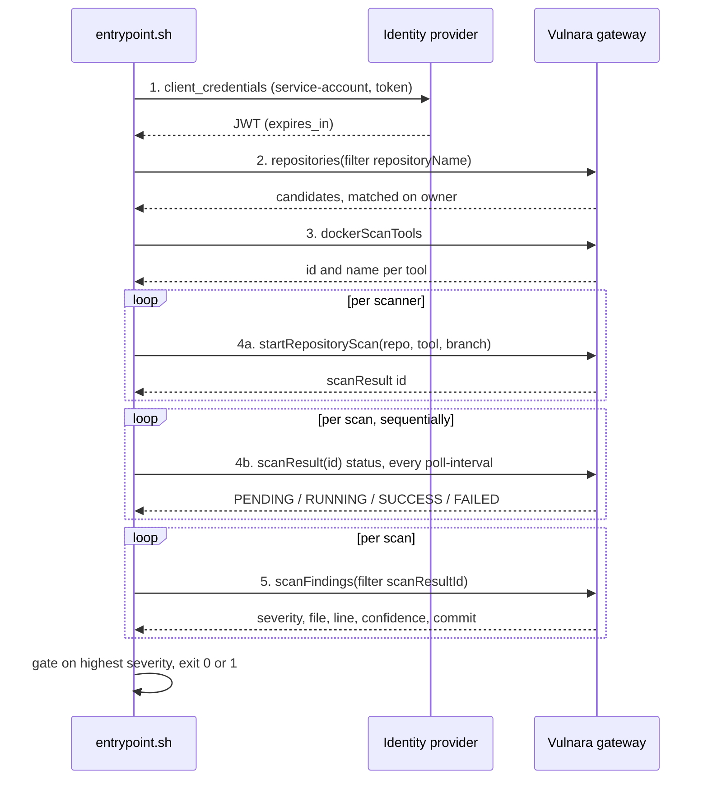

# Architecture

[Back to the README](../README.md)

`vulnara-action` is a client, not a service. It holds no state, stores nothing and runs no
scanner itself: the Vulnara platform clones the repository and runs the scan containers. The
action is a Docker container action whose entire implementation is one Bash script driving
`curl` and `jq`.

## Where it sits

The action talks to exactly two hosts, and both are overridable so it can be pointed at a
non-production Vulnara.

The web app is never called. `app-url` is used only to build links in the job summary.

## Components

| Piece | Where it runs | What it does |
|---|---|---|
| `action.yml` | GitHub | Declares the inputs, outputs and the Docker runner |
| `Dockerfile` | GitHub runner | `alpine:3.20` plus `bash`, `curl`, `jq`, `tar`, `ca-certificates` |
| `entrypoint.sh` | GitHub runner | The whole implementation: auth, GraphQL, polling, gate, summary |
| Vulnara gateway | Vulnara | The only API this action calls. Owns authentication and tenancy |
| Vulnara scanners | Vulnara | Clone the branch and produce the findings |

There is no build step and no package manager. Nothing is downloaded at run time.

## The five-step flow

Each step is printed to the log as `vulnara: [n/5]`.

1. **Authenticate.** An OAuth 2.0 `client_credentials` exchange trades `service-account` plus
   `token` for a JWT. The JWT is cached and re-exchanged when fewer than 120 seconds of its
   `expires_in` remain, so a scan that outlives the token does not fail the job.
2. **Resolve the repository.** A `repositories` query filtered on `repositoryName` returns the
   candidates; the action picks the one whose git entity name matches the owner half of
   `repository`, case-insensitively. It prints the Vulnara id, provider, visibility, languages
   and enabled flag, and warns if the repository is disabled, or private with no
   `git-token-id`. See [the resolution caveat](troubleshooting.md#the-wrong-repository-is-scanned).
3. **Resolve the scanners.** `dockerScanTools` is queried once and each entry in `scan-tools`
   is matched against a tool id or a tool name, case-insensitively. An unknown name aborts the
   step and lists the available tools, but see
   [the exit-0 caveat](troubleshooting.md#a-tool-resolution-failure-passes-the-gate).
4. **Start and await the scans.** One `startRepositoryScan` mutation per scanner, all fired
   before any waiting begins, then `scanResult { status }` is polled every `poll-interval`
   seconds until each reaches `SUCCESS`. `FAILED` or `CANCELLED` fails the job immediately.
   The waits are sequential and each carries its own `wait-timeout`, which is
   [the third caveat](troubleshooting.md#a-multi-scanner-run-takes-far-longer-than-wait-timeout).
5. **Evaluate the findings.** `scanFindings` is queried per scan result, findings are counted
   per severity, the job summary is rendered, the outputs are written and the gate decides the
   exit code. See [Reference](reference.md).

## Request shape

Every GraphQL request is a JSON POST to `gateway-url` carrying `Authorization: Bearer <jwt>`
and `X-Tenant: <tenant>`. Bodies are built with `jq -n`, so no input is interpolated into a
query unencoded. A response containing `errors` prints each `extensions.code` and `message`
and fails the run.

## Related

- [Configuration](configuration.md), [Reference](reference.md),
  [Troubleshooting](troubleshooting.md), [Development](development.md), [Testing](testing.md)
- [`openspec/specs/scan-orchestration/spec.md`](../openspec/specs/scan-orchestration/spec.md)
  is the normative version of this page.
